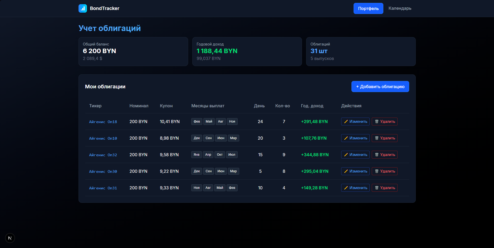

## \[🇷🇺\] Трекер облигаций

Приложение для контроля облигаций (инвестиций в ценные бумаги) с календарём выплат. Упрощает и ускоряет работу с инвестициями, анализом, а так-же визуально предоставляет данные о финансах.

- Валюту можно самостоятельно поменять в коде
- Мульти валюта не поддерживается

*(В репозитории есть database.db с тестовыми данными)*




## Стек

- **Frontend** - Next, React, Axios
- **Backend** - Python, FastAPI
- **API** - Axios
- **UI** - Tailwindcss, react-icons
- **Data** - SQLite, sqlalchemy

## Установка  
#### 1. Клонируйте репозиторий

```bash
git clone https://github.com/XCraiteX/simple-bonds-tracker.git
```

#### 2. Измените валюту (если необходимо)

Файл: `frontend/src/app/page.tsx`  
Строки: `93`, `108`, `114`

Файл: `frontend/src/app/calendar/page.tsx`  
Строки: `39`

#### 3. Запустите docker-compose

Директория: `/`

```bash
docker-compose up --build
```

---

♥️ Created by XCraiteX

<br>

## \[🇺🇸\] Bonds Tracker

An application for monitoring bonds (investments in securities) with a payment calendar. It simplifies and speeds up working with investments, analysis, and visually presents financial data.

- The currency can be manually changed in the code.
- Multi-currency is not supported.

*(The repository includes a database.db file with test data)*


## Stack

- **Frontend** - Next, React, Axios
- **Backend** - Python, FastAPI
- **API** - Axios
- **UI** - Tailwindcss, react-icons
- **Data** - SQLite, sqlalchemy

## Установка  
#### 1. Clone the repository

```bash
git clone https://github.com/XCraiteX/simple-bonds-tracker.git
```

#### 2. Change currency (if you need)

File: `frontend/src/app/page.tsx`  
Strings: `93`, `108`, `114`

File: `frontend/src/app/calendar/page.tsx`  
Strings: `39`

#### 3. Run docker-compose

Directory: `/`

```bash
docker-compose up --build
```

---

♥️ Created by XCraiteX